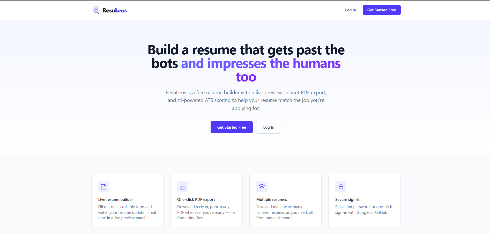
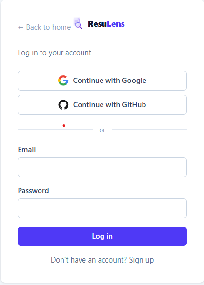
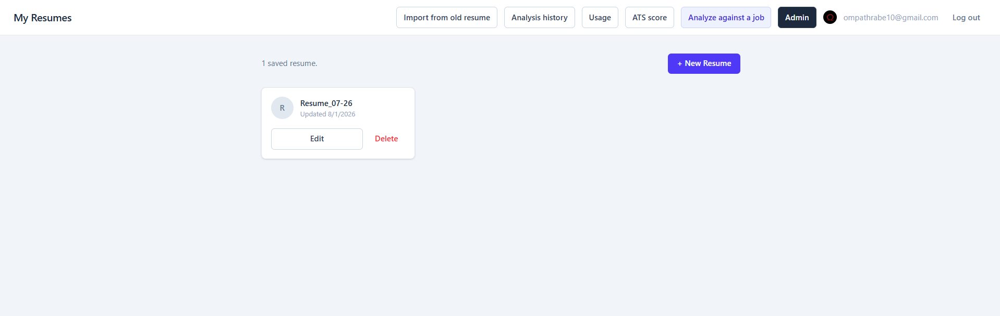
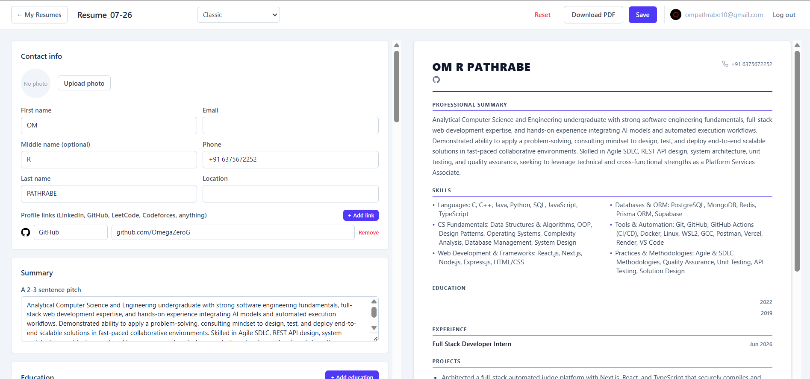
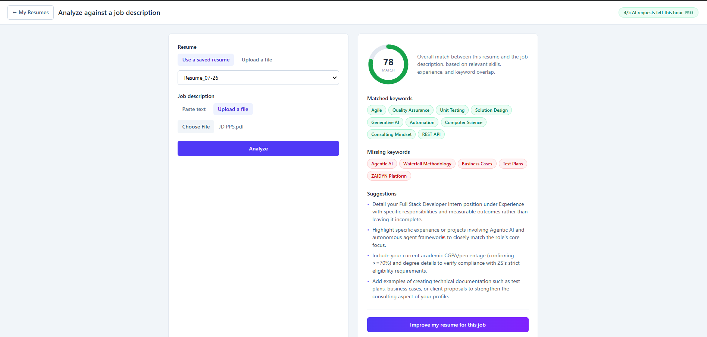
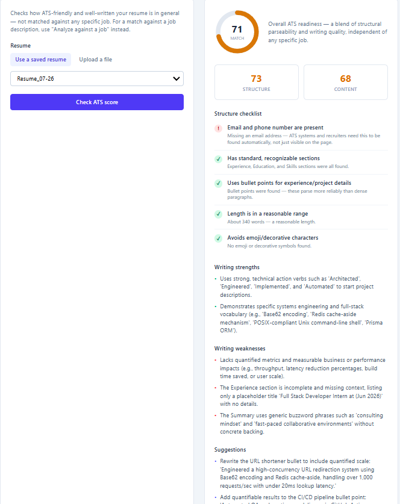
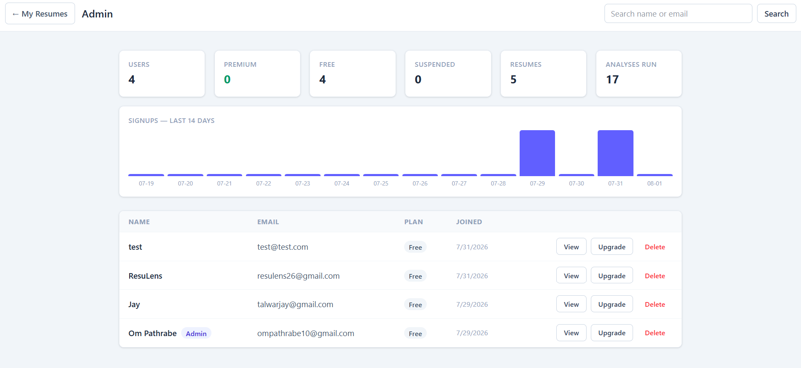
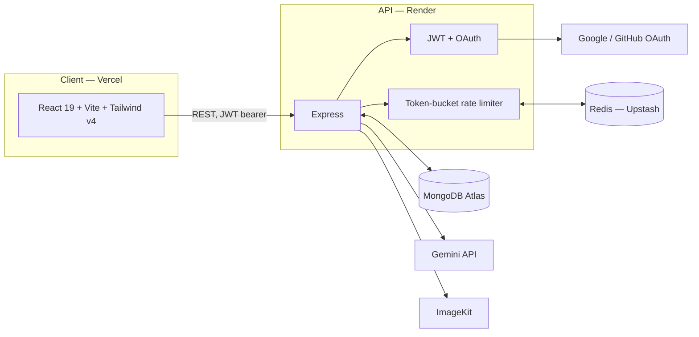

<p align="center">
  
</p>

<p align="center">
  <a href="https://github.com/OmegaZeroG/ResuLens/actions/workflows/ci.yml"></a>
  
  
  
  
  
</p>

<p align="center"><strong>AI resume analyzer, JD-based ATS optimizer, and a hand-built rate-limited AI gateway — a full MERN app, solo-built end to end.</strong></p>

<p align="center">
  <a href="https://resu-lens-delta.vercel.app"><strong>Live demo →</strong></a>
</p>

---

ResuLens scores a resume against a real job description, tells you exactly what's missing, and can rewrite the resume to close the gap — without inventing facts. It also runs an AI-free structural ATS check, exports resumes as real (not screenshot) PDFs across 5 distinct templates, and includes an admin panel for account management. Every AI call is metered per user through a Redis-backed token-bucket rate limiter built from scratch, not a third-party middleware.

## Features

**Resume builder**
- Multi-section form (contact, summary, education, experience, skills, projects, custom sections) with a live preview panel
- 5 visually distinct templates — Classic, Jake's Resume, Compact Two-Column, Modern, Harvard — each with its own real jsPDF export (selectable text, clickable links, correct pagination — not a screenshot-to-PDF)
- Multiple saved resumes per account, a dashboard to switch between them
- "Import from old resume" — upload a PDF/DOCX/TXT, Gemini faithfully transcribes it into the schema (no rewriting)

**Profile photo pipeline**
- ImageKit-hosted upload with automatic face-centered cropping
- Hybrid background removal — tries ImageKit's server-side AI removal first, falls back automatically to an in-browser ML model (`@imgly/background-removal`, ONNX/WASM) if that fails or the free quota is exhausted
- Client-side canvas compositing to fill the transparent result with a solid color

**AI analysis**
- Score a resume (saved or freshly uploaded) against a pasted/uploaded job description — match score, matched/missing keywords, specific suggestions
- "Improve" — rewrites the resume to close the gap for a given JD, truthfully (no invented employers, numbers, or skills), saves it as a new resume and re-scores it
- Independent ATS score with no JD needed — deterministic structural checks (parseable text, contact info, standard sections, bullet usage, length) combined with an AI-judged content-quality score (action verbs, quantified impact, clarity)
- Full analysis history, revisitable per resume

**Auth**
- Email/password (bcrypt + JWT) and OAuth (Google, GitHub) — hand-rolled token-exchange flow, no Passport/SDK
- Account suspension, enforceable mid-session regardless of how the token was issued

**AI rate limiting** (see [design notes](#ai-rate-limiting--design-notes) below)
- Token-bucket algorithm, atomic via a Redis Lua script, tiered by plan (free/premium)
- Self-service usage dashboard; admin can reset a user's quota early

**Admin panel**
- Platform stats (user/plan/resume/analysis counts, a 14-day signup chart)
- Searchable user table — manually upgrade/downgrade plans, suspend/reactivate, permanently delete an account (cascades their resumes/analyses/usage log)
- Per-user detail view — their resumes, recent analyses, recent AI request activity
- Bootstrapped via a local CLI script, not an in-app "become admin" button (see [Admin access](#admin-access))

**CI/CD**
- GitHub Actions: lint + build on every push/PR for both client and server, plus the real server test suite
- Auto-deploy on merge to `main` — frontend on Vercel, backend on Render

## Screenshots

| | |
|---|---|
|  |  |
|  |  |
|  |  |
|  | |

<sub>Full checklist / exact filenames: [`docs/screenshots/README.md`](docs/screenshots/README.md)</sub>

## Architecture



## Stack

React (Vite) + Tailwind v4 · Node/Express · MongoDB Atlas + Mongoose · Redis (Upstash) · Gemini API · ImageKit · JWT · jsPDF

## Structure

```
ResuLens/
├── client/     React (Vite) frontend
├── server/     Express API
└── docs/       README assets (screenshots)
```

## Local setup

### Server
```
cd server
cp .env.example .env   # fill in your own MongoDB URI, JWT secret, API keys
npm install
npm run dev
```

### Client
```
cd client
cp .env.example .env   # VITE_API_URL=http://localhost:5000
npm install
npm run dev
```

Client runs on http://localhost:5173, API on http://localhost:5000.

### Environment variables

All server variables are documented with inline comments in `server/.env.example`. Summary:

| Variable | Required | Notes |
|---|---|---|
| `MONGO_URI` | Yes | MongoDB Atlas connection string |
| `JWT_SECRET` | Yes | Any long random string |
| `GEMINI_API_KEY` | Yes | From Google AI Studio |
| `GEMINI_MODEL` | No | Defaults to `gemini-flash-latest` |
| `IMAGEKIT_PUBLIC_KEY` / `IMAGEKIT_PRIVATE_KEY` / `IMAGEKIT_URL_ENDPOINT` | Yes | From the ImageKit dashboard |
| `UPSTASH_REDIS_REST_URL` / `UPSTASH_REDIS_REST_TOKEN` | No | Rate limiting fails open (unlimited) if unset |
| `GOOGLE_CLIENT_ID` / `GOOGLE_CLIENT_SECRET` / `GOOGLE_REDIRECT_URI` | No | Google sign-in disabled if unset |
| `GITHUB_CLIENT_ID` / `GITHUB_CLIENT_SECRET` / `GITHUB_REDIRECT_URI` | No | GitHub sign-in disabled if unset |
| `CLIENT_URL` | Yes | Frontend origin — used for CORS and OAuth redirects |

Client: just `VITE_API_URL`, pointing at the API's base URL.

## Deployment

Live at **[resu-lens-delta.vercel.app](https://resu-lens-delta.vercel.app)** — frontend on Vercel, backend on Render, both auto-deploying on push to `main`.

Note: the backend is on Render's free tier, which spins down after inactivity — the first request after idle can take 30–50 seconds to wake up. Not a bug, just the tradeoff of a free tier.

<details>
<summary>Deploying your own copy</summary>

1. **MongoDB Atlas** → Network Access → allow `0.0.0.0/0` (Render's free tier has no static outbound IP).
2. **Render**: new Web Service from this repo, Root Directory `server`, Build Command `npm install`, Start Command `npm start`. Add every var from `server/.env.example` as a real secret.
3. **Vercel**: new project from this repo, Root Directory `client`, framework auto-detects as Vite. One env var: `VITE_API_URL` = your Render URL.
4. Back in Render, set `CLIENT_URL` to your real Vercel URL (exact match, no trailing slash — CORS checks this exactly) and redeploy.
5. **Google Cloud Console**: add `https://<your-render-url>/api/auth/google/callback` to the OAuth client's Authorized redirect URIs (it supports a list, keep localhost too).
6. **GitHub OAuth App**: only one callback URL is allowed per app (no list, unlike Google) — either make a second app for production or accept that local GitHub login breaks while pointed at prod.

</details>

## Admin access

There's no in-app "become admin" button, on purpose — an admin session that could grant admin rights over its own API is a bigger privilege-escalation surface than this project needs, and there's a real bootstrap problem anyway (the panel needs an admin to exist before it could be used to make one). Promote an account directly:

```
cd server
node scripts/setAdmin.js you@example.com
```

## AI rate limiting — design notes

Every Gemini call (`/api/analyze`, `/api/analyze/improve`) is metered per user with a token-bucket rate limiter, enforced atomically in Redis (Upstash) via a Lua script. This exists because Gemini calls cost real money/quota — without a limit, one user in a loop, a retry bug, or a scripted request against the API could burn through the whole app's quota and break it for everyone else, not just the offending user.

**Why token bucket, not a plain counter.** The simplest alternative is `INCR` a per-hour key with `EXPIRE` — genuinely less code, and `INCR` is already atomic on its own. Its flaw is the classic fixed-window boundary burst: a user can spend their whole quota at 12:59:59, then immediately get a full new quota at 1:00:01 — up to 2x the intended rate right at the hour mark. A token bucket refills continuously instead of resetting in a hard cliff, so that edge case doesn't exist. For a low-traffic project this is a minor difference in practice, but it's the standard approach for a reason and was worth doing properly.

**Why Redis specifically, not an in-memory counter.** An in-memory counter only lives in one Node process's RAM. It's wiped by every restart (a deploy, a crash, or — on a free-tier host that spins down on inactivity — just normal idle behavior), silently resetting everyone's usage. It also breaks the moment there's more than one server instance, since each instance would keep its own separate count and a user could multiply their real limit just by which instance happened to handle each request. Redis is a single shared store every instance talks to, so the limit holds regardless of how many processes are running or how often they restart.

**Why a Lua script, not separate GET/SET calls.** Checking "do I have enough tokens" and decrementing them has to happen as one atomic operation. Two round trips (read, then write) leaves a race window where two concurrent requests can both read "1 token left" and both proceed, over-spending the bucket. `EVAL` runs the whole check-and-decrement as a single atomic operation inside Redis itself, so concurrent requests from the same user can't race past the limit. The script also reads Redis's own clock (`TIME`) rather than trusting the app server's clock, so it stays correct even if they drift.

**Design choices:**
- Tiered by the existing `User.plan` field — `free`: 5 requests/hour, `premium`: 30/hour. `Improve` costs 2x an `Analyze` (it's a full resume rewrite, not just a score). An admin can move a user between plans manually from the admin panel.
- **Fails open, not closed.** If Redis isn't configured, or a request to it errors, AI features keep working unlimited rather than the whole app breaking over a rate-limiter outage. A protective feature shouldn't itself become the single point of failure for the thing it's protecting.
- Every check (allowed or blocked) is logged to Mongo (`RateLimitEvent`) purely for visibility — a user's own usage history is viewable in the app, and an admin can see any user's recent activity. Redis remains the only source of truth for enforcement; the log is never read by the limiter itself.
- `X-RateLimit-Limit/Remaining/Reset/Tier` response headers, following the same convention as GitHub/Stripe's rate-limit headers, so the client (or any other API consumer) can react to quota state without guessing.

**Testing.** `server/src/middleware/tokenBucketReference.js` is a pure-JS mirror of the Lua script's algorithm, covered by `tokenBucketReference.test.js` (burst limits, per-user isolation, refill-over-time, the 2x cost tier). `rateLimiter.test.js` covers the actual middleware — header setting, tiering, the fail-open paths, and the 429 response — with Redis and Mongo mocked. Run with `npm test` inside `server/`.

## Notes on scope

A few things were deliberately left as-is rather than "fixed," worth calling out rather than leaving silent:

- Deleting a resume (or a user, which cascades their resumes) doesn't clean up the corresponding ImageKit photo file — it's orphaned in the ImageKit account. Flagged in `TASKS.md`, not fixed.
- No client-side test suite yet — `server/` has a real Vitest suite (rate limiter + ATS rules), the client currently doesn't.
- No true multi-tenant admin roles (just a single `isAdmin` boolean) — sufficient for this project's scale, not built out further on purpose.

Full task history and the reasoning behind each build decision: `../TASKS.md` and `../PROGRESS.md` (outside this repo, in the parent planning folder).
